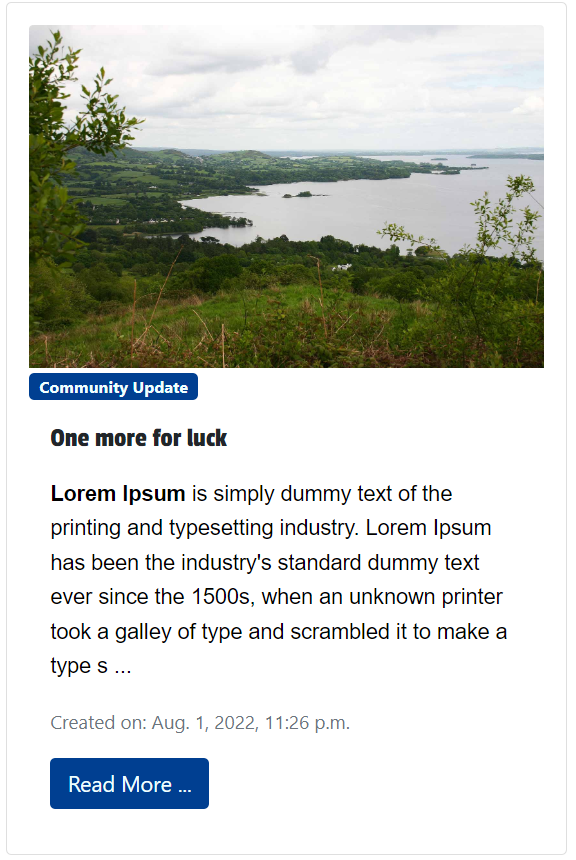

# Ogonnelloes Community Website

[Ogonnelloes Community Website](https://community-website-ogonnelloe.herokuapp.com/) is a website where people can come and find information on the lovely village of Ogonnelloe. Local clubs and businesses can register information and provide posts with updates/information and users can register to comment on these posts. Admins have control over what clubs/businesses post and they in turn have control over comments that are added to their pages in terms of comments.

---

## Contents

- [Ogonnelloes Community Website](#ogonnelloes-community-website)
  - [Contents](#contents)
  - [UX](#ux)
    - [Epics](#epics)
    - [User Stories](#user-stories)
      - [**Fonts**](#fonts)
  - [Database Diagrams](#database-diagrams)
  - [Database Diagram](#database-diagram)
  - [Technologies](#technologies)
    - [Languages](#languages)
    - [Libraries & Frameworks](#libraries--frameworks)
    - [Tools](#tools)
  - [Features](#features)
    - [Implemented Features](#implemented-features)
      - [**User Account**](#user-account)
      - [**Super User**](#super-user)
  - [Testing](#testing)
  - [Deployment](#deployment)
    - [Local Deployment](#local-deployment)
    - [Deployment to Heroku](#deployment-to-heroku)
  - [Credits](#credits)
    - [Images](#images)
    - [Image editing](#image-editing)
    - [Code ideas](#code-ideas)
  - [Acknowledgements](#acknowledgements)

---
# UX
## Epics

### Groups
1. CRUD their profile details
2. Add updates about their groups
3. Approve/Delete users comments
### Businesses
1. CRUD their profile details
### Users
1. Can comment and like other comments on community update posts
2. Can request to join Groups
3. When registered give a rating to a business
### Visitors
1. Can navigate the site intuitively
2. Can view all information/pages containing community updates
3. Can create a user account
4. Fill out a form to request to be a Group or Business
### Admin
1. Register Groups/Businesses
2. Approve/Delete Groups/Businesses posts
3. CRUD functionality for community updates
4. Approve/Delete Users comments on 

## User Stories

Numbers indicate sprint number (note: due to time frame some items in Sprint 1 did not get developed).

### Visitors
1. Can view each page for community information (1)
2. Can view posts of community updates (1)
3. Can register for an account (1)
5. Can delete account (1)
6. Can comment on posts (1)
7. Can like others comments (1)

### Users
1. Can sign in/out (1)
3. Can add comments to group posts (2)
4. Can like other comments (2)
5. Can add notice to notice board (4+)

### Admin
1. Can CRUD community website update posts (1)
2. Can create a draft community website update post (1)
3. Can approve User comments (1)
4. Can CRUD main page details (4)
5. Can approve users comments (2)
6. Can approve Business registration (3)
7. Can CRUD <page name> details (4+)
8. Can approve notices on notice board (4+)

### Businesses
1. Can fill out a form to register their business (3)
2. Can sign in (3)
3. Can sign out (3)
3. Can CRUD their own details (3)

### Groups
1. Can fill out a form to register their business (1)
2. Can sign in (1)
3. Can sign out (1)
4. Can CRUD their own details (1)
5. Can CRUD update posts for their club (1)
6. Can approve/delete comments on posts (2)

[Back to content](#contents)

#### **Fonts**

- *All fonts*

The Celtic font from fontzip.com is used for the Logo. Patua One is used for all headings with Arial as a web safe backup font. Both fonts are very strong, supportive (to the rest of the content) and impactful which mirror the ethos of Ogonnellow GAA.For the body text the font Merriweather was chosen with serif as backup. Both being clean and precise as only Ogonnelloe can be!

[Back to content](#contents)

---

## Database Diagrams

### Community Update Posts

| Key          | Name           | Type             | Extra Info                   |
|--------------|----------------|------------------|------------------------------|
|              | Title (Unique) | CharField        | Max length 200               |
| ForeignKey   | Author         | User model       | Cascade on delete            |
|              | Created date   | DateTime         | auto_now_add=True            |
|              | Updated date   | DateTime         | auto_now=True                |
|              | Content        | TextField        |                              |
|              | Featured Image | Cloudinary Image |                              |
| Many to Many | Likes          | User model       |                              |
|              | Slug (Unique)  | SlugField        | Max length 200               |
|              | Status         | Integer          | Draft by default (default=0) |

### Community Post Comments

| Key         | Name        | Type          | Extra Info        |
|-------------|-------------|---------------|-------------------|
| Foreign Key | post        | Post model    | Cascade on delete |
|             | commenter   | CharField     | Max length 80     |
|             | body        | TextField     |                   |
|             | created_on  | DateTimeField | auto_now_add=True |
|             | updateed_on | DateTimeField | auto_now=True     |
|             | approved    | BooleanField  | default False     |

### Notice

| Key | Name             | Type            | Extra Info        |
|-----|------------------|-----------------|-------------------|
|     | id               | BigAutoField    | primary_key       |
|     | approved         | BooleanField    | default=False     |
|     | creator          | CharField       | max_length=80     |
|     | description      | TextField       |                   |
|     | contact_number   | CharField       | max_length=25     |
|     | contact_email    | EmailField      | max_length = 254  |
|     | location         | CharField       | max_length=60     |
|     | background_image | CloudinaryField |                   |
|     | created_on       | DateTimeField   | auto_now_add=True |

### Database Diagram


[Back to content](#contents)

---  

## Technologies

### Languages

- [HTML](https://developer.mozilla.org/en-US/docs/Web/HTML)
- [CSS](https://developer.mozilla.org/en-US/docs/Web/CSS)
- [JavaScript](https://developer.mozilla.org/en-US/docs/Web/JavaScript)
- [Python](https://www.python.org/)

### Libraries & Frameworks

- [Django](https://www.djangoproject.com/)
- [Django Crispy Forms](https://django-crispy-forms.readthedocs.io/en/latest/)
- [Bootstrap](https://getbootstrap.com/)
- [Gunicorn](https://pypi.org/project/gunicorn/)
- [Psycopg2](https://pypi.org/project/psycopg2/)
- [Font-Awesome](https://fontawesome.com/icons?d=gallery)

### Tools

- [PIP](https://pypi.org/project/pip/)
- [Git](https://git-scm.com/)
- [GitHub](https://github.com/)
- [Heroku](https://www.heroku.com/)
- [PyCharm](https://www.jetbrains.com/pycharm/)
- [Favicons](https://www.flaticon.com/search?word=stag&order_by=4)
- [Cloudinary](https://cloudinary.com/)

[Back to content](#contents)

---

## Features

The website is designed using three applications: `Community Website`, `Community Updates`,  and `Noticeboard`.

### Nav

The nav allows you to navigate through the site. Depending on whether you're logged in or not it looks slightly different.


### Community Update Card

The community update card shows a preview of a full community update. There is a button that opens the community update in a detailed page.



### Notice card for noticeboard

This card shows a notice for the noticeboard.


### Sign in 

A user can sign in to make notices and to like community updates.


### Sign Out

A user can sign out of their account.


### Sign Up/ Register

A user can register an account.


### Add notice

A user can click the add notice button on the noticeboard page and go to add notice page. Here they can fill out a form to add a notice.


### Comments Section

Logged out user can view comments.


Logged in user can view and comments. User can also like the main community update.


### Implemented Features

- The site has **responsive design** when viewed on a mobile, tablet, and desktop.
- The user is given feedback when they interact with the website (i.e. login to the website, add new gift, commit to buying a gift etc).

#### **User Account**

- The users can **create** an account where they can add comments and CRUD notices for the noticeboard.

#### **Super User**

- The **Super User** can verify that the community update comments and the notices added to the noticeboard.

[Back to content](#contents)

---

## Testing

Testing was done with automatic unit tests. All tests can be found in the tests.py files of the apps and can be ran in the terminal using the command `python manage.py test`.

[Back to content](#contents)

---

## Deployment

**Ogonnelloe Community Updates** project was deployed using the **PyCharm IDE**, using **Git** and **GitHub** for version control. It is hosted on **Heroku** and all media files are hosted in **Cloudinary**.

Before deploying the application, install the following:

- Python 3
- PIP
- Git
- Heroku CLI

### Local Deployment

To deploy community-website-ogonnelloe locally, take the following steps:

1. From the applications [repository](https://github.com/sean-meade/community-website-ogonnelloe), click the *code* button and download the zip file.

    Alternatively, you can clone the repository using the following line in your terminal:

```terminal
git clone https://github.com/sean-meade/community-website-ogonnelloe.git
```

2. Access the folder in your terminal window and install the application's required modules with the following command:

```terminal
pip3 install -r requirements.txt
```

3. Create the follwing environmental variables on your machine:

```
DATABASE_URL = YOUR_DATABASE_URL
SECRET_KEY = YOUR_DJANGO_SECRET_KEY
CLOUDINARY_URL = YOUR_CLOUDINARY_KEY
DEBUG_BOOL = True (False for production)

```

4. If your IDE terminal, migrate the models to create the database using the following commands:

```terminal
python manage.py makemigrations
python manage.py migrate
```

5. Create a superuser to access the admin panel using the following command:

```terminal
python manage.py createsuperuser
```

Then follow the instructions to create the superuser.

6. After you login to the admin panel, you can add data to be displayed in your app. Refer to [database modeling](#database-modelling).


7. To initiate the application, type the command `python manage.py runserver` in your terminal. The application is now available in your browser at the address: `http://127.0.0.1:8000/`

[Back to content](#contents)

### Deployment to Heroku

To deploy the app to Heroku, use the following steps:

1. Ensure you have the following dependancies installed in your app, such as PostgressSQL driver for Python, WSHI HTTP Server and dj database url that connects the app with the database:

```terminal
pip3 install psycopg2-binary

pip3 install install gunicorn

pip3 install dj_database_url
```

2. If you haven't already, create `requirements.txt` file containing all of the dependancies:

```terminal
pip3 freeze > requirements.txt
```

3. Create a `Procfile` that contains the following: `web: gunicorn community_website_ogonnelloe.wsgi`.
4. Push these newly created files to your repository master.
5. Login to Heroku and create a new app.
6. In Heroku dashboard of the new app, click **deploy**, then **deployment** method and select **GitHub** to connect your app to your github repository for automatic deployment.
7. In Heroku Resources tab, navigate to **Add-Ons** section and search for **Heroku Postgres**. I recommend you choose hobby level for this application. You should also search for **Cloudinary - Image and Video Management** to ensure your media files load to Cloudinary.
8. In settings tab, navigate to **Reveal Config Vars** and add the following variables:

| **KEY**        | **VALUE**              |
|----------------|------------------------|
| CLOUDINARY_URL | YOUR_CLOUDINARY_URL    |
| DATABASE_URL   | YOUR_DATABASE_URL      |
| DEBUG_BOOL     | YOUR_DEBUG_BOOL        |
| SECRET_KEY     | YOUR_DJANGO_SECRET_KEY |

9. In settings.py in your IDE, temporarily comment out the database and use below code instead (make sure you do not commit!):

```python
DATABASES = {
        'default': dj_database_url.parse('POSTGRESS URL')
    }
```

10. In terminal, migrate the models to create the Postgress database using the following commands:

```terminal
python manage.py makemigrations
python manage.py migrate
```

11. Create a superuser to access the admin panel using the following command:

```terminal
python manage.py createsuperuser
```

Then follow the instructions to create the superuser.

12.  After you login to the admin panel, you can add data to be displayed in your app if required.

13. Remove the temporary database from settings.py and uncomment the original code, then push the code to origin.
14.  Back to in **Heroku dashboad**, deploy the application.
15.  To view the site, click on **View App**.

[Back to content](#contents)

---

## Credits

### Images

* All images were taken by local photographer Mike Mc Namara


[Back to content](#contents)

